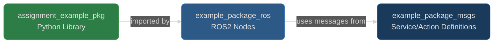
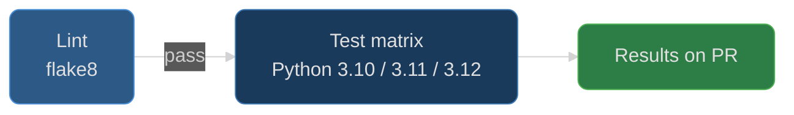

# Example Package

[](https://github.com/calebjakemossey/assignment_example_pkg/actions/workflows/ci.yaml)

A ROS-independent Python package containing the `Example` class. It can be used separately from ROS for general-purpose applications.

## System Overview



> **Note on ROS2 distribution:** The original assignment referenced ROS2 Iron, which reached end-of-life in December 2024. The CI pipeline targets ROS2 Humble (LTS, supported until May 2027).

## CI Pipeline

The CI workflow runs on every PR to `main` and every push to `main`. Lint gates the test matrix - tests do not start until linting passes.



For details on the overall CI architecture and shared workflow design, see the [ci-workflows repository](https://github.com/calebjakemossey/ci-workflows).

## Dependencies

This package depends on the `pyfiglet` package to generate ASCII art.

## Description

The `Example` class is a simple Python class that stores a message and provides methods to retrieve it and render it as ASCII art using the `pyfiglet` package.

Note that the `package.xml` as well as the `resource` directory don't really do anything but add support for this package to be added to a ROS workspace.

## Installation

You can install this package using `pip`. It is recommended to use a virtual environment to avoid conflicts with other packages.

```bash
# Create a virtual environment named 'venv'
python3 -m venv venv

# Activate the virtual environment
source venv/bin/activate
```

Once activated, your shell prompt should change to indicate you're in the virtual environment.
Now you can install packages within this virtual environment.

### Install using `pip`

```bash
# Navigate to the example_package directory
cd example_package

# Install the package along with its dependencies
pip install .
```

This will install the `example_package` and its dependencies to the (virtual) environment.
Alternatively, you can install the dependencies separately:

```bash
# Install dependencies
pip install -r requirements.txt

# Install the package
pip install .
```

### Using `setup.py`

Alternatively, you can install the package using the `setup.py` script directly:

```bash
# Navigate to the example_package directory
cd example_package

# Install the package
python setup.py install
```

## Usage

After installation, you can import the `Example` class in your Python scripts and use it as follows:

```python
from example_package.example import Example

# Create an instance of the Example class with a custom message
example_instance = Example('Hello, World!')

# Retrieve the message
message = example_instance.get_example_message()
print(message)  # Output: Hello, World!

# Render the message as ASCII art
ascii_art = example_instance.get_ascii_art()
print(ascii_art)
```

**Sample Output of `get_ascii_art()`:**

```
 _   _      _ _                            _     _ _
| | | | ___| | | ___   __      _____  _ __| | __| | |
| |_| |/ _ \ | |/ _ \  \ \ /\ / / _ \| '__| |/ _` | |
|  _  |  __/ | | (_) |  \ V  V / (_) | |  | | (_| |_|
|_| |_|\___|_|_|\___/    \_/\_/ \___/|_|  |_|\__,_(_)
```

See also an example in [example_package/example_runner.py](example_package/example_runner.py)

Basic usage:

```bash
example_runner "Your Message Here"
```

Display Message as ASCII Art:

Use the `--ascii` flag to display the message as ASCII art.

```bash
example_runner "Sunrise" --ascii
```

**Sample Output:**

```
/ ___| _   _ _ __  _ __(_)___  ___
\___ \| | | | '_ \| '__| / __|/ _ \
 ___) | |_| | | | | |  | \__ \  __/
|____/ \__,_|_| |_|_|  |_|___/\___|
```

## Running Unit Tests

To ensure that the `Example` class is working correctly, you can run the unit tests provided in the `tests` directory.

### Running the Tests

```bash
# Navigate to the example_package directory
cd example_package

# Activate the virtual environment if you created one
source venv/bin/activate

# Run the tests using pytest
python -m pytest tests/
```

## Contributing

See [CONTRIBUTING.md](CONTRIBUTING.md) for development setup, testing, and PR workflow.
